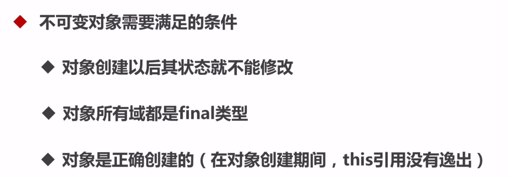

## 线程安全策略

### 1.不可变对象



* 创建补课变对象

  这里可以采用的方式有：

  * 将类声明为final，不允许继承
  * 将类所有的成员变量声明为私有的，这样就不能直接访问类成员
  * 对变量不提供set方法，将所有可变的成员声明为final，这样只能对他们赋值一次
  * 在构造方法中所有变量进行复制，进行深度拷贝
  * 在get方法中不直接返回变量本身而是克隆对象，并返回对象的拷贝。

  对于要创建不可变对象，我们应多参考String和final类

* final关键字

  **1. 数据**

  声明数据为常量，可以是编译时常量，也可以是在运行时被初始化后不能被改变的常量。

  - 对于基本类型，final 使数值不变；
  - 对于引用类型，final 使引用不变，也就不能引用其它对象，但是被引用的对象本身是可以修改的。

  ```
  final int x = 1;
  // x = 2;  // cannot assign value to final variable 'x'
  final A y = new A();
  y.a = 1;
  ```

  **2. 方法** 

  声明方法不能被子类覆盖。

  private 方法隐式地被指定为 final，如果在子类中定义的方法和基类中的一个 private 方法签名相同，此时子类的方法不是覆盖基类方法，而是在子类中定义了一个新的方法。

  **3. 类**

  声明类不允许被继承。

* 将对象修改为不可变对象

  

  * Java提供的Collections类，值得注意的是Collections修改的对象不能是final的。使用参见com.bravedawn.concurrency.example.immutable.ImmutableExample2
  * Guava提供的ImmutableXXX，值得注意的是Collections修改的对象可以是final的。使用参见com.bravedawn.concurrency.example.immutable.ImmutableExample3