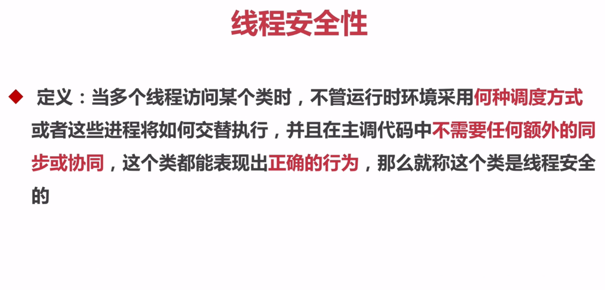
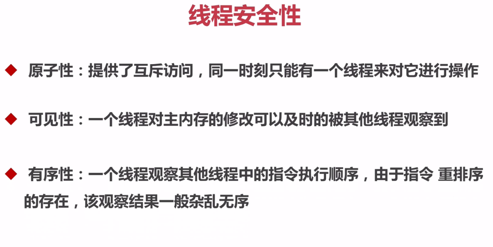

# Java并发编程

## 线程安全性

### 线程安全性-原子性

* 线程安全性的定义
   

* 线程安全性的组成

   

* AtomicXXX：CAS、Unsafe.compareAndSwapInt（atomic包下的方法具有原子性）

  参见com.bravedawn.concurrency.example.count.CountExample2

  * CAS取的其实就是compareAndSwapInt的三个首字母，调用该方法的源码如下：

    ```
    // public static AtomicInteger count = new AtomicInteger(0);
    count.incrementAndGet();
    ```

    ```
    // java.util.concurrent.atomic.AtomicInteger
    public final int incrementAndGet() {
    	return unsafe.getAndAddInt(this, valueOffset, 1) + 1;
    }
    ```

    ```
    // sun.misc.Unsafe
    public final int getAndAddInt(Object var1, long var2, int var4) {
        int var5;
        do {
        	var5 = this.getIntVolatile(var1, var2);
        } while(!this.compareAndSwapInt(var1, var2, var5, var5 + var4));
    
        return var5;
    }
    ```

    上面三段代码是我们调用Java底层实现的compareAndSwapInt方法的步骤，在第三段代码段中，var1也就是count，var2是当前对象的值，var4是要增加的值，var5是底层的值。compareAndSwapInt方法在当前的值var2与底层的值var5相等时，才会执行var5 + var4。

   * 为什么对象count的值var会与底层的值var5不相同呢？

     对象count的值var2是工作内存的值，而var5是主内存中的值。他们的值不一定是相等的。需要我们做同步操作使得他们在某一时刻是相等的。

 * AtomicLong、LongAdder

   参见：com.bravedawn.concurrency.example.atomic.AtomicExample2；com.bravedawn.concurrency.example.atomic.AtomicExample3

   * AtomicLong是作用是对长整形进行原子操作，显而易见，在java1.8中新加入了一个新的原子类LongAdder，该类也可以保证Long类型操作的原子性，相对于AtomicLong，LongAdder有着更高的性能和更好的表现，可以完全替代AtomicLong的来进行原子操作。
   * 在32位操作系统中，64位的long 和 double 变量由于会被JVM当作两个分离的32位来进行操作，所以不具有原子性。而使用AtomicLong能让long的操作保持原子型。
   * 【LongAdder优点】LongAdder在AtomicLong的基础上将单点的更新压力分散到各个节点，在低并发的时候通过对base的直接更新可以很好的保障和AtomicLong的性能基本保持一致，而在高并发的时候通过分散提高了性能。 
   * 【LongAdder缺点】缺点是LongAdder在统计的时候如果有并发更新，可能导致统计的数据有误差。
   * 【博客】[AtomicLong和LongAdder的区别]()https://blog.csdn.net/yao123long/article/details/63683991

 * AtomicBoolean#compareAndSet

   参见：com.bravedawn.concurrency.example.atomic.AtomicExample6

    * 在实际项目中，我只希望一件事情只执行一次，在执行之前该事件的标记可能为false，一旦执行之后标记就会变成true。此时我们调用AtomicBoolean#compareAndSet(false, ture)方法，就可保证对于我们需要执行的那一段代码以原子方式只执行一次。可以理解为同一时间只有一个线程会执行这段代码。

* AtomicReference

  参见：com.bravedawn.concurrency.example.atomic.AtomicExample4

  * AtomicReference原子更新引用类型。

  * AtomicReference.compareAndSet的示例代码中我们调用了unsafe.compareAndSwapObject方法，与先前介绍的CAS方法原理一致

* AtomicReferenceFieldUpdater

  参见：com.bravedawn.concurrency.example.atomic.AtomicExample5

  * AtomicReferenceFieldUpdater是基于反射的原子更新字段的值，是用来更新某一个类指定的字段的值
  * 要求该字段：
    * 字段必须是volatile类型的
    * 只能是实例变量，不能是类变量，也就是说不能加static关键字

* AtomicStampReference：CAS的ABA问题
  * ABA问题

    1、可以发现，CAS实现的过程是先取出内存中某时刻的数据，在下一时刻比较并替换，那么在这个时间差会导致数据的变化，此时就会导致出现“ABA”问题。 

    2、什么是”ABA”问题？ 
    比如说一个线程one从内存位置V中取出A，这时候另一个线程two也从内存中取出A，并且two进行了一些操作变成了B，然后two又将V位置的数据变成A，这时候线程one进行CAS操作发现内存中仍然是A，然后one操作成功。

   * AtomicStampReference中的核心方法compareAndSet。除了对象值，AtomicStampedReference内部还维护了一个“状态戳” stamp。状态戳可类比为时间戳，是一个整数值，每一次修改对象值的同时，也要修改状态戳，从而区分相同对象值的不同状态。当AtomicStampedReference设置对象值时，对象值以及状态戳都必须满足期望值，写入才会成功

 * AtomicLongArray：根据索引原子更新长整型数组里的元素