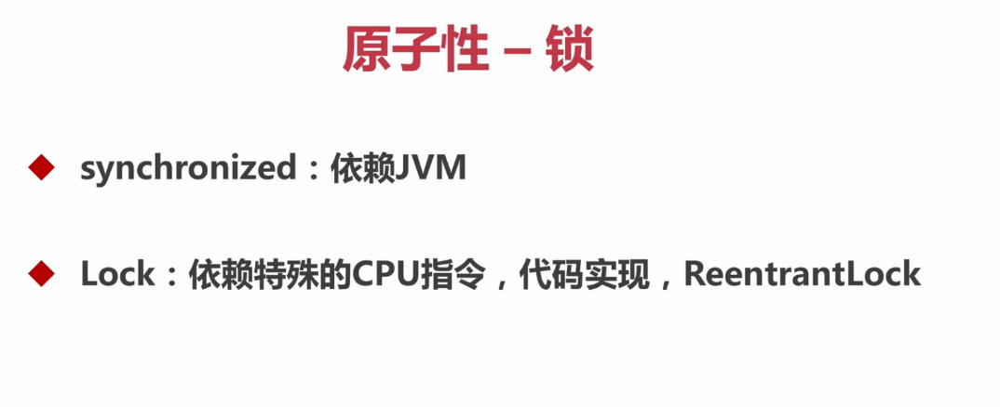
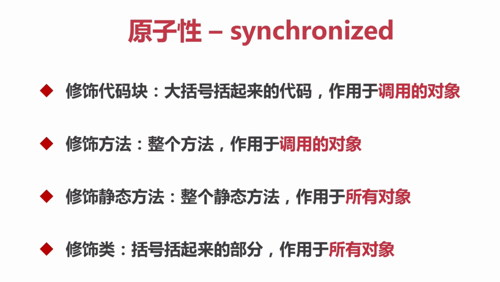
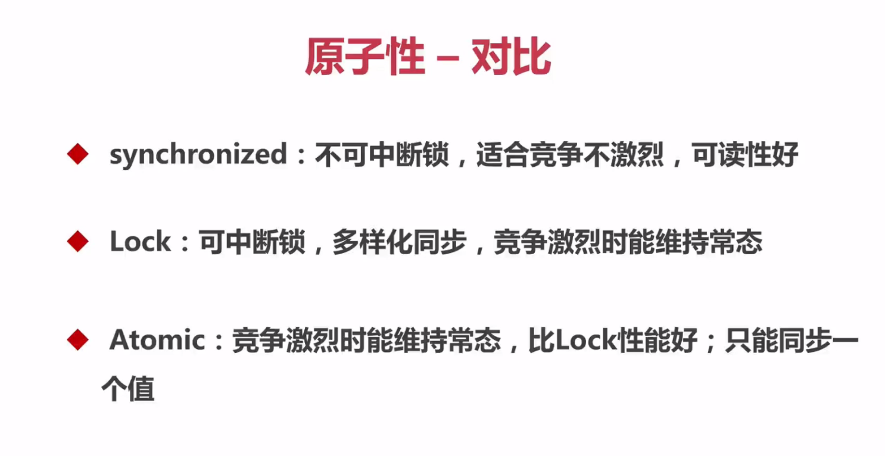

# Java并发编程

## 线程安全性
### 原子性——锁（JDK中提供原子性的除了atomic之外还有锁——下面的两个锁）



* **synchronized**它是一种同步锁

  

  

  * 为什么要是用线程池？

    使用线程池的目的是为了查看同一对象的两个进程同时调用函数时的情况。

  * synchronized关键字不能继承

    * 子类继承父类时，如果没有重写父类中的同步方法，子类同一对象，在不同线程并发调用该方法时，具有同步效果。
    * 子类继承父类，并且重写父类中的同步方法，但没有添加关键字synchronized，子类同一对象，在不同线程并发调用该方法时，不再具有同步效果，这种情形即是"关键字synchronized不能被继承"的转述。

   * synchronized修饰代码块

     参见：com.bravedawn.concurrency.example.sync.SynchronizedExample1；com.bravedawn.concurrency.example.sync.SynchronizedExample2

     ```java
     // 修饰一个代码块：同步语句块
     public void test1(){
         synchronized (this){
         for (int i = 0; i < 10; i++){
             	log.info("test1 - {}", i);
             }
         }
     }
     ```

  * synchronized修饰方法

    参见：com.bravedawn.concurrency.example.sync.SynchronizedExample1；com.bravedawn.concurrency.example.sync.SynchronizedExample2

    ```java
    // 修饰一个方法：同步方法
    public synchronized void test2(){
        for (int i = 0; i < 10; i++){
        	log.info("test2 - {}", i);
        }
    }
    ```

  * synchronized修饰静态方法

    参见：com.bravedawn.concurrency.example.sync.SynchronizedExample3

    ```java
    public synchronized static void test2(int j){
        for (int i = 0; i < 10; i++){
        	log.info("test2 {} - {}", j, i);
        }
    }
    ```

  * synchronized修饰类

    参见：com.bravedawn.concurrency.example.sync.SynchronizedExample3

    ```java
    public void test1(int j){
        synchronized (SynchronizedExample3.class){
            // 以下就是括号括起来的问题
            for (int i = 0; i < 10; i++){
            	log.info("test1 {} - {}", j, i);
            }
        }
    }
    ```

  * 在上面的四个synchronized修饰的代码片中，如果**synchronized修饰代码块**和**synchronized修饰方法**的作用域代码相同时，他们两的功能就是相同的，可以相互替换。如果**synchronized修饰静态方法**和**synchronized修饰类**的作用域代码相同时，他们两的功能就是相同的，可以相互替换。

* 原子性对比

  
