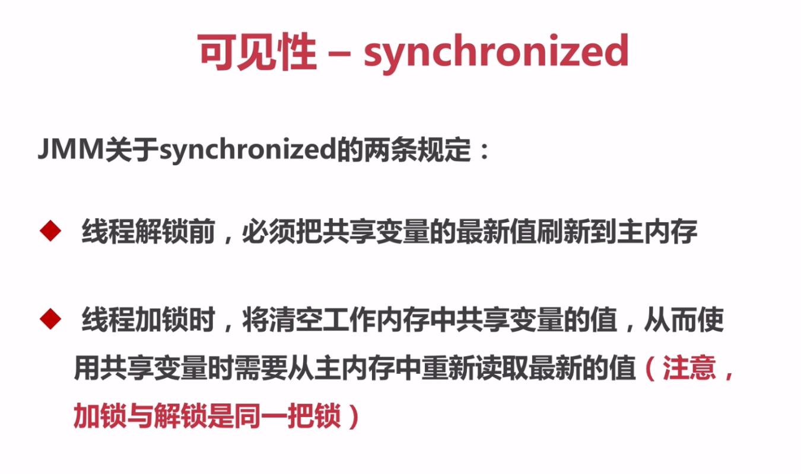
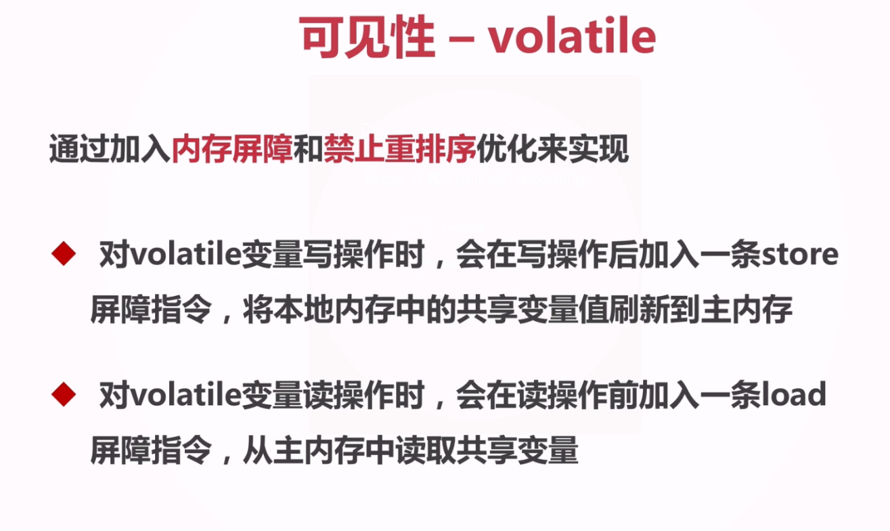
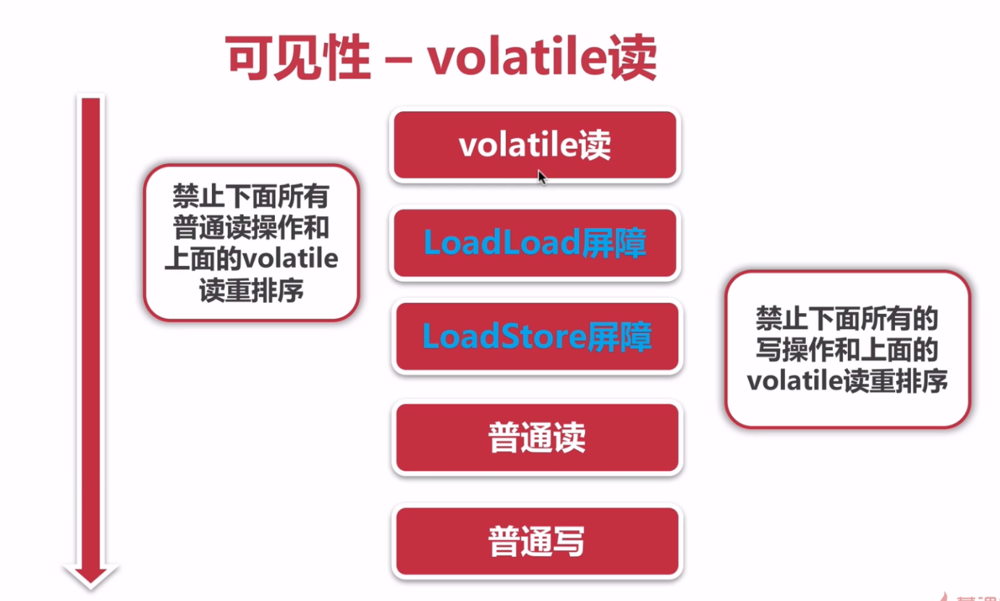
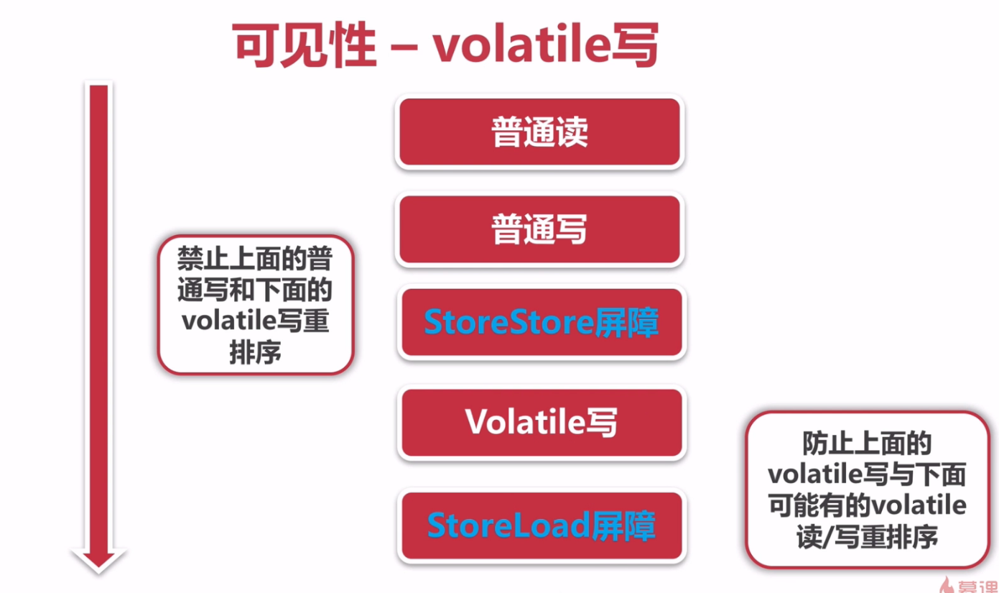

### 可见性
# Java并发编程

## 线程安全性

**可见性**则更为微妙，它必须确保释放锁之前对共享数据做出的更改对于随后获得该锁的另一个线程是可见的。 —— 如果没有同步机制提供的这种可见性保证，线程看到的共享变量可能是修改前的值或不一致的值，这将引发许多严重问题。


* 可见性——synchronized

  

* 可见性——volatile

  

* volatile读写操作加入内存屏障和禁止重排序的CPU指令示意图
    

    

  参见：com.bravedawn.concurrency.example.count.CountExample4，在这个计数的程序中：

  ```java
  public static volatile int count = 0;
  
  private static void add(){
      count++;
  }
  ```

  我们将count变量加了**volatile**关键字，但时还是**不能保证线程的原子性**。再看下面的add方法，这次这里的执行顺序主要有三步，若此时同时有两个进程：

  * 首先他们会从主内存中将count变量的值取出来
  * 然后再同时加1
  * 最后他们再同时将工作内存的值写回主内存

  完成上面的三步后，其实真正计数的值只增加了一次。**所以直接使用volatile执行加操作不是线程安全的**。

* volatile的使用条件

  * 对变量的写操作不依赖于当前值。
  * 该变量没有包含在具有其他变量的不变式中。

  所以volatile特别适合作为状态标识量。

* 使用场景一：volatile作为状态标识量的使用方法

  ```java
  volatile boolean inited = false;
  
  // 线程1
  context = loadContext();
  inited = true;
  
  // 线程2
  while(!inited){
      sleep();
  }
  doSomethingWitConfig(context);
  ```

  上述代码必须先执行完loadContext()，才能执行doSomethingWitConfig(context)。

* 使用场景二：Double-Check