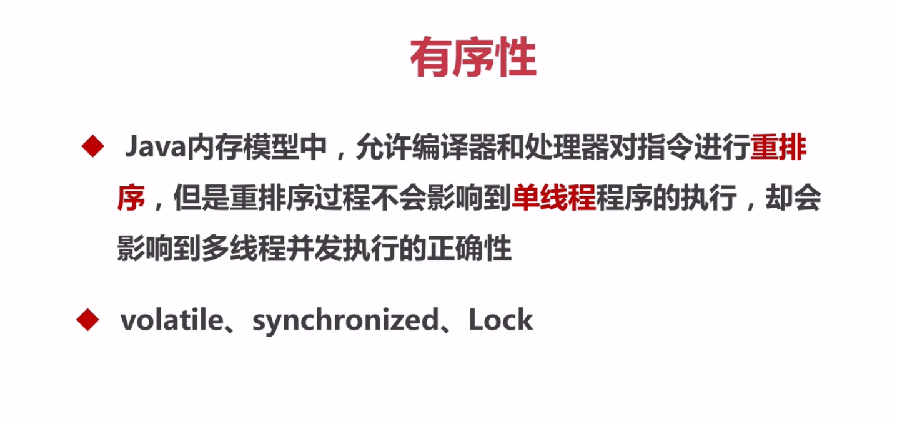

# Java并发编程

## 线程安全性
### 有序性

* 其中synchronized、Lock保证同一时刻只有一个线程执行同步代码，相当于让线程顺序徐执行同步代码，自然就保证了有序性。

* 在java内存模型中说过，为了性能优化，编译器和处理器会进行指令重排序；也就是说java程序天然的有序性可以总结为：**如果在本线程内观察，所有的操作都是有序的；如果在一个线程观察另一个线程，所有的操作都是无序的**。

* [happens-before原则](https://www.cnblogs.com/chenssy/p/6393321.html)

  * **在JMM中，如果一个操作执行的结果需要对另一个操作可见，那么这两个操作之间必须存在happens-before关系。**

  * **如果两个操作不存在下述（下面8条 ）任一一个happens-before规则，那么这两个操作就没有顺序的保障，JVM可以对这两个操作进行重排序。如果操作A happens-before操作B，那么操作A在内存上所做的操作对操作B都是可见的。**

  * 下面是happens-before原则规则：

    * **1、**程序次序规则：一个线程内，按照代码顺序，书写在前面的操作先行发生于书写在后面的操作

      一段代码在**单线程中执行的结果是有序的**。注意是执行结果，因为虚拟机、处理器会对指令进行重排序。虽然重排序了，但是并不会影响程序的执行结果，所以程序最终执行的结果与顺序执行的结果是一致的。**故而这个规则只对单线程有效，在多线程环境下无法保证正确性**。

    * **2、**锁定规则：一个unLock操作先行发生于后面对同一个锁额lock操作

      这个规则比较好理解，无论是在单线程环境还是多线程环境，一个锁处于被锁定状态，那么必须先执行unlock操作后面才能进行lock操作。

    * **3、**volatile变量规则：对一个变量的写操作先行发生于后面对这个变量的读操作

      这是一条比较重要的规则，它标志着volatile保证了线程可见性。通俗点讲就是如果一个线程先去写一个volatile变量，然后一个线程去读这个变量，那么这个写操作一定是happens-before读操作的。

    * **4、**传递规则：如果操作A先行发生于操作B，而操作B又先行发生于操作C，则可以得出操作A先行发生于操作C

      提现了happens-before原则具有传递性，即A happens-before B , B happens-before C，那么A happens-before C

    * 5、线程启动规则：Thread对象的start()方法先行发生于此线程的每个一个动作

    * 6、线程中断规则：对线程interrupt()方法的调用先行发生于被中断线程的代码检测到中断事件的发生

    * 7、线程终结规则：线程中所有的操作都先行发生于线程的终止检测，我们可以通过Thread.join()方法结束、Thread.isAlive()的返回值手段检测到线程已经终止执行

    * 8、对象终结规则：一个对象的初始化完成先行发生于他的finalize()方法的开始