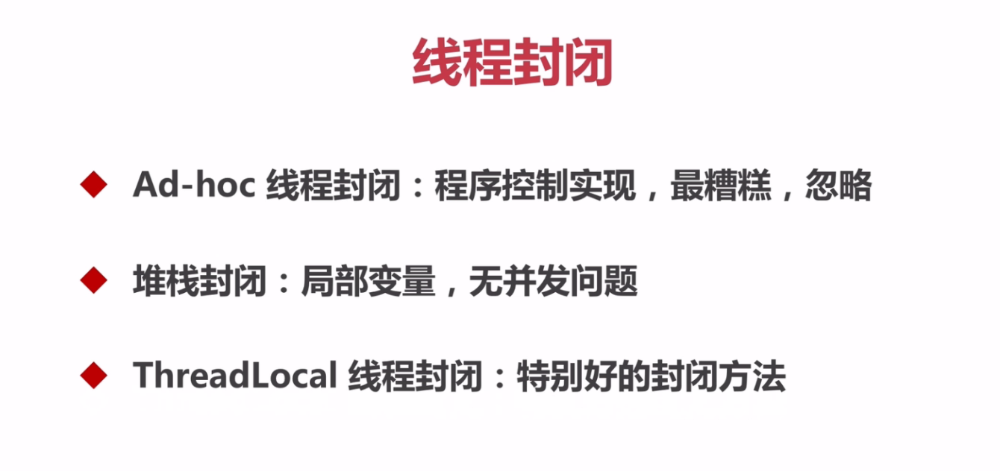

## 线程安全策略

### 2.线程封闭

* 堆栈封闭解释：

  多个线程访问一个方法的时候，方法的局部变量都会拷贝一份到线程的栈中。所以局部变量不会被多个线程所共享的。因此就不会出现并发问题，所以能局部变量的时候就不用全局变量，全局变量会引发并发问题。

* ThreadLocal（详情参见：com.bravedawn.concurrency.example.threadlocal）

  * 使用TreadLocal的相关场景：

    在我们进行web开发的时候，用户的每一个请求就是一个线程。一般的话我们获取用户的信息，需要在controller层通过request进行获取，然后传到service层或者是util里，这样传递数据是很费劲麻烦的。而我们使用TreadLocal之后，我们在请求已经到了后端服务器，在进行处理之前调用RequestHolder.add()将相关信息保存到ThreadLocal中，之后我们随用随取，当请求结束后，我们在调用RequestHolder.remove()。

  * 具体实现

    * ThreadLocal处理类：com.bravedawn.concurrency.example.threadlocal.RequestHolder
    * Filter类：com.bravedawn.concurrency.HttpFilter
    * Interceptor类：com.bravedawn.concurrency.HttpInterceptor
    * Controller类：com.bravedawn.concurrency.example.threadlocal.ThreadlocalController
    * 配置类，用于配置Filter和Interceptor：com.bravedawn.concurrency.ConcurrencyApplication